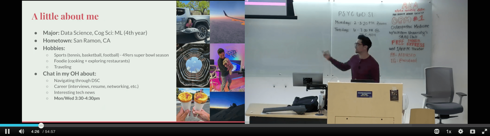

---
---

 &nbsp;

## About Me ✌🏽

Welcome to my website! I'm Yash, a Software Engineer in the San Francisco Bay Area. I'm currently a **Software Engineer** at Rivian and am concurrently pursuing a Masters in **Computer Science with a Specialization in Interactive Intelligence** at <a href="https://www.cc.gatech.edu/" target = "_blank">Georgia Institute of Technology</a>.

Previously, I studied at <a href="https://datascience.ucsd.edu/" target = "_blank">UC San Diego</a>, where I graduated with highest honors (summa cum laude) while pursuing a double major in **Data Science** and **Cognitive Science: Machine Learning**.

I'm originally from the SF Bay Area 🌉. I enjoy traveling, experiencing new cultures through food, and playing/following sports (go Niners and Warriors)!

One of my passions is teaching and mentorship. During my time at UCSD, I served as an Instructional Assistant for several undergraduate data science courses and led workshops for students interested in data science. Check out my [**workshops**](workshops)!

I'm a highly motivated individual interested in the fields of data science and AI, looking to make a positive impact by solving challenging problems. I'm always looking to learn something new and connect with others! Feel free to connect on LinkedIn!

## Work Experience 🧑🏽‍💻

  <a href="https://rivian.com/" target = "_blank">Rivian ⚡ 🚙</a>
  
Palo Alto, CA

**Software Engineer II, Vehicle Merchandising**  
**June 2023 – present**
- Designed and implemented an automation pipeline allowing the Merchandising organization to make sales changes efficiently and at-scale, allowing for a more seamless customer purchase and configuration experience. 
- Collaborate cross-functionally with product managers to define key milestones, identify service gaps, and coordinate with downstream teams and engineers for effective resolution.

**Software Engineer Intern, Core Services**  
**Palo Alto, CA**  
**June 2022 – September 2022**
- Architected and deployed a production-level service facilitating the settlement of vehicle transactions at scale.
- Improved the customer experience by streamlining internal communication pertaining to vehicle deliveries.
- Wrote documentation and wrote a tutorial to hand off my project to future developers, explain my design decisions, and identify areas of extension for other teams.

  <a href="https://datascience.ucsd.edu/" target = "_blank">Halıcıoğlu Data Science Institute 📊 🧑🏽‍🏫</a> 
  
La Jolla, San Diego, CA

**Data Science Instructional Assistant (IA)**  
**La Jolla, San Diego, CA**  
**September 2020 – March 2023**
- Led 9 weekly discussion sections for a class of 120 undergraduate students, where I walked through challenging questions from the weekly programming assignment in order to solidify course concepts.
- Held weekly office hours to clarify Python and statistics concepts from lectures and guide students through programming assignments.
- Designed and created programming assignments and a final project to assess students' understanding of course concepts.
- Served as an Instructional Assistant for <a href="https://dsc10.com/" target = "_blank">DSC 10</a> **5 times** and for <a href="https://dsc80.com/" target = "_blank">DSC 80</a> **2 times**.

  <a href="https://wefunder.com/hugs" target="_blank">HUGS (Startup) 🏡</a>
  
San Diego, CA

**Developer**  
**May 2021 - June 2022**  
|| 
**Software Engineering Intern, R&D**  
**March 2021 - May 2021**
- Created wireframe prototypes and design language documents for the product, which is a housing portal that aims to bridge the gap between international students and landlords.
- Served as one of the initial Engineers and designed features for the housing platform.

  <a href="https://www.logicmonitor.com/" target = "_blank">LogicMonitor ☁️ 🤖</a>
  
Santa Barbara, CA

**Data Science Intern, R&D**  
**June 2021 - August 2021**
- Researched and developed an early-stage feature on LogicMonitor's platform for root cause analysis of alerts. 
- Wrote a Confluence tutorial in order to explain to future developers the usage of the application, how I developed it, and areas of improvement so developers can continue working on the product.

## University Organizations 🎓

### <a href="https://www.ucsdtcg.org/" target = "_blank">Triton Consulting Group (TCG) 🕴️</a>
**VP Human Capital Management (HCM)**  
**June 2022 - March 2023**
- Planned social events, recruitment events, club retreats, study group sessions, and more to build a sense of community within TCG. 
- Implemented strategies to foster a culture of inclusivity and increase retention within the organization.

**Project Manager**  
**October 2020 - June 2022**
- Led the first iteration of a data analytics project for predicting churn using Machine Learning and analyzing ROI for a healthcare firm, which became a recurring client for TCG.
- Led a team of 5 Associates and worked directly with the CFO in order to successfully deliver a key project within scope, timeline, and budget.  
- Conducted primary and secondary research and created a long-term marketing plan for UCSD’s Price Center.

### <a href="https://ds3.ucsd.edu/" target = "_blank">Data Science Student Society (DS3) 📊</a>
[***Data Science Workshops***](workshops)
<!-- <a href="https://ds3.ucsd.edu/" target = "_blank">Data Science Student Society (DS3) 📊</a> -->

**Professional Development Workshops Lead**  
**June 2021 - September 2022**
- Led the development of **2 workshops** dedicated to career development for undergraduate members of the Data Science Student Society.
- Delivered workshops to prepare students for internship recruitment, such as resume reviews, networking sessions, or Leetcode workshops.

**Kaggle Workshop Committee Member**  
**June 2020 - June 2021**
- Delivered **6 workshops** on industry-relevant data science topics such as Pandas, Scikit-learn (sklearn) modeling, pipelines, and anomaly detection.
- Created content with the other Workshop Committee members in order to engage students interested in data science and enhance their learning.

### <a href="https://acmucsd.com/communities#Cyber" target = "_blank">ACM Cyber 🥷🏼 💻</a>
**Director of Finance & Logistics**  
**July 2020 - June 2021**
- Coordinated club events, which include workshops, networking events, seminars, and socials.
- Interfaced with other ACM Cyber Board members to seamlessly hold virtual events, due to the COVID-19 pandemic.
- Cultivated relationships with industry contacts for sponsors and mentors for organization members.
- Managed sponsorships and fundraising to ensure organization operations run smoothly. 
- Secured funding to cover the expenditures from competition registration, event organization, and travel.

## Projects 🧑🏽‍🍳

- **Deep Learning for Pulmonary Edema Classification using Image Segmentation** 🫁 🫀 
    - Trained multiple convolutional neural network (CNN) architectures in order to diagnose pulmonary edema from chest X-rays.
    - Utilized transfer learning with a lung and heart image segmentation network in order to understand the impact of segmentation.
    - Worked closely with a radiologist from UC San Diego Health for two quarters during this Data Science Senior Capstone project.
    - <a href="assets/DeepLearningEdemaPoster.png" target = "_blank">***Poster***</a>, <a href="https://yashpotdar.github.io/deep-learning-pulmonary-edema/" target = "_blank">***Website***</a>, <a href="assets/Deep_Learning_Edema.pdf" target = "_blank">***Paper***</a>
- **Facebook Redesign** 🧓🏽 #️⃣ 
    - Conducted a UX case study for a Facebook redesign aimed to increase accessibility for the 65+ community and reduce sentiments of isolation and depression among this demographic.
    - Interviewed members of the 65+ community in order to understand their core needs, pain points, and values.
    - Designed high-fidelity and wireframe prototypes of the app redesign.
    - <a href="https://yashpotdar.github.io/facebook-redesign/" target = "_blank">***Website***</a>
- **Generating Sherlock Holmes Passages with Recurrent Neural Networks** 🕵️‍♂️ 🗒️ 
    - Explored the potential of recurrent neural networks (RNNs) to generate literature using a sample corpus.
    - Tested and evaluated several RNN architectures with tuned hyperparameters.
    - <a href="assets/Generating_Passages_RNN.pdf" target = "_blank">***Paper***</a>, <a href="https://github.com/YashPotdar/Generating-Sherlock-Passages-RNN/blob/main/Char_Rnn.ipynb" target = "_blank">***Notebook***</a>
- **NYPD Police Complaint Classification Model** 🚔
    - Developed a DecisionTreeClassifier to predict whether civilian cases against officers in the New York Police Department were substantiated.
    - Evaluated the parity of the classifier using the True Positive Parity measure to assess whether the model had systematic biases.
    - Utilized scikit-learn transformers and pipelines to engineer features and develop the algorithm.
    - Notebooks: <a href="https://github.com/YashPotdar/NYPD_Civilian_Complaints/blob/main/nypd_permutation_test.ipynb" target = "_blank">***Permutation Test***</a>, <a href="https://github.com/YashPotdar/NYPD_Civilian_Complaints/blob/main/nypd_classification_model.ipynb" target = "_blank">***Classification ML Model***</a>
- **MLB Pitch Classification** ⚾ 
    - Utilized supervised ML algorithms (Decision Trees and K-Nearest Neighbors) to solve the multi-label classification problem of classifying pitches as Changeups, Curveballs, Fastballs, or Sliders.
    - <a href="https://www.kaggle.com/yashpotdar/mlb-pitch-classification-by-knn-and-decision-trees" target = "_blank">***Website***</a>

 

 <i>Teaching discussion!</i> 🧑🏽‍🏫

